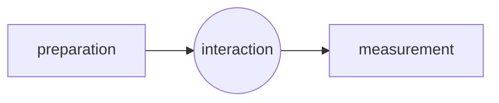

# Kinematics of Quantum Mechanics

In classical physics, there is no need to talk of measurement!

**Preparation**: Set of actions that determines all possibility distributions of any possible measurement. Different preparations can lead to identical probability distribution.

A state describes all details relevant for subsequent measurements.

**Mathematically** represent division of preparations and measurements as follows

**Observables** are hermitian elements of **observable algebra** $\mathscr{A}$.

An $\mathbb{C}$-Algebra is a set closed under multiplication and addition as well as multiplication by scalars in $\mathbb{C}$. Each element $A \in \mathscr{A}$ has adjoint $A^{\dagger}$.

An element $E \in \mathscr{A}$ is **positive** if $\exist A \in \mathscr{A}$ s.t. $E = A^{\dagger}A$.

**For us** $\mathscr{A}$ will always be $\mathcal{B}(\mathscr{H})$, the set of bounded operators on some hilbert space $\mathscr{H}$.

**Example**: **Qubit**: set of observables are $2 \times 2$ hermitian matrices 
$$
\mathscr{A}_h \subset \mathscr{A} \cong M_2(\mathbb{C}) \equiv 
\left\{
\begin{pmatrix}
a & b \\
c & d
\end{pmatrix} \bigg | a,b,c,d \in \mathbb{C}
\right\}
$$

$$
\mathscr{A}_h \equiv \{X \in \mathscr{A} | X^{\dagger} = X\}
$$

In fact observables are somehow theoretical idealization, and not the thing you are measuring in a experiment. Instead in experiments you have some detectors that goes **click**. You can always break the detector in a experiment down into a sequence of clicking objects.  

**Measurements** themselves (not observables) are described by assigging to each outcome of a device an **effect** $E \in \mathscr{A}$, which satisfies
$$
0 \le E \le \mathbb{I}
$$
We say $A \le B \Leftrightarrow B-A = X^{\dagger}X$. An effect is a observable.

E.g. **photon counter**: $E = |0 \rangle \langle 0|$ "no click"; $F = \mathbb{I} - |0 \rangle \langle 0 |$ "click".

A state $\omega$ on $\mathscr{A}$ is a positive normalized linear functional on $\mathscr{A}$. That is 
$$
\omega: \mathscr{A}  \to \mathbb{C} 
$$
is linear.
$$
\omega(X^{\dagger}X) \ge 0
$$

$$
\omega(\mathbb{I}) = 1
$$

The **probability** of outcome $E$ measured on a state $\omega$
$$
p(E) = \omega(E)
$$
Label outcomes corresponding to an observable $A \in \mathscr{A}$ by index $\alpha$. ($\alpha$ can be continuous) We assign to each $\alpha$ an effect $E_{\alpha}$ so that $p_{\alpha}$ is equal to the probability of outcome "$\alpha$" is $p_{\alpha} \equiv \omega(E_{\alpha})$. In order that $\sum_{\alpha} p_{\alpha} = 1$ we demand $\sum_{\alpha} E_{\alpha} = \mathbb{I}$.

A collection $\{E_{\alpha}\}_{\alpha}$ of effects such that $\sum_{\alpha} E_{\alpha} = \mathbb{I}$ is called **POVM** (positive operator-valued measure). The precise connection between observable and effects is via eigenvalue decomposition
$$
A = \sum_{\alpha} a_{\alpha} E_{\alpha}
$$
where $a_{\alpha}$ is a eigenvalue and $E_{\alpha}$ is a spectral projection (effect). Every observable give rise to a POVM, but **not** every POVM comes from a observable.

For **finite-dimensional** systems, e.g., qubits, we can always represent states $\omega: \mathscr{A} \to \mathbb{C}$ as density operators via
$$
\omega(A) = \operatorname{tr}(\rho A)
$$
where $\operatorname{tr}(\rho) = 1$ and $\rho \ge 0$.

A state $\omega$ is pure if it cannot be written 
$$
\omega = (1 - p) \omega^{\prime} + p \omega^{\prime \prime}
$$
with $0 < p < 1$ (convex combination) and $\omega^{\prime} \neq \omega''$. 

For finite dimensional quantum systems $\omega$ is **pure** if and only if
$$
\omega(\cdot) \equiv \operatorname{tr}(\rho \cdot)
$$
with $\rho = | \psi \rangle \langle \psi |$, where $| \psi \rangle \in \mathscr{H}$.

Probability of outcome represented by 
$$
p(E) = \omega(E)
$$
$E$ is a positive element of algebra $\mathscr{A}$.