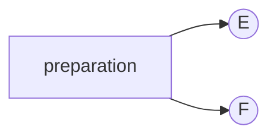
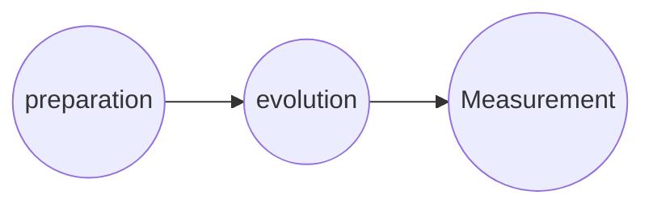

- Locality and composite systems
- Dynamics

## Composite systems

The observables for a quantum system $AB$ with observable algebra $\mathscr{A}$ and $\mathscr{B}$, respectively, is 
$$
\mathscr{A} \otimes \mathscr{B}
$$

$E \in \mathscr{A}$, $F \in \mathscr{B}$, $E \otimes F \in \mathscr{A} \otimes \mathscr{B}$. "$E$ and $F$ occur".

**Examples**: 2 qubits A and B

$\mathscr{A}, \mathscr{B} \cong M_2 (\mathbb{C})$, $\mathscr{A} \otimes \mathscr{B} = M_2(\mathbb{C}) \otimes M_2(\mathbb{C}) \cong M_4(\mathbb{C})$

There exists $M \in \mathscr{A} \otimes \mathscr{B}$ such that $M \neq E \otimes F$

Ex.:

**State of composite systems**:
$$
\omega: \mathscr{A} \otimes \mathscr{B} \to \mathbb{C}
$$
such that
$$
\omega(\mathbb{I} \otimes \mathbb{I}) = 1 \\
\omega(X^{\dagger}X) \ge 0
$$
underlying hilbert space $\mathscr{H}$ of AB
$$
\mathscr{H} \equiv \mathscr{H}_A \otimes \mathscr{H}_B
$$
simple set of states on $\mathscr{A} \otimes \mathscr{B}$ coming from $|\phi_A \rangle \otimes |\phi_B \rangle$, where $|\phi_A \rangle \in \mathscr{H}_A$ and $|\phi_B \rangle \in \mathscr{H}_B$.

Product states $\omega$ of composite system $AB$ are of form
$$
\omega(X \otimes Y) = \omega_A(X) \omega_B(Y), \quad \forall x \in \mathscr{A}, \forall Y \in \mathscr{B}
$$
Pure product states have density operator
$$
\rho \equiv | \phi_A \rangle\langle\phi_A| \otimes | \phi_B \rangle\langle\phi_B| = \rho_A \otimes \rho_B
$$
states which **aren't** products are **correlated**.

**Example**: 2 qubits
$$
\rho = p |00 \rangle \langle00| + (1-p) | 11 \rangle \langle 11|
$$

## Reduced states

We have a quantum system $A$, and the environment $E$. THe state $\omega_{AE}$ when restrict to observables which are nontrivial only $A$, is of the form 
$$
X_A \otimes \mathbb{I}_E
$$
is called the reduced state
$$
\omega_A(X_A) = \omega_{AE}(X_A \otimes \mathbb{I}_E)
$$
For density operators we define $\rho_A$ for $\omega_A$ via 
$$
\operatorname{tr}(\rho_A X) = \omega_A(X \otimes \mathbb{I_E} ) = \operatorname{tr}(\rho_{AE} X_A \otimes \mathbb{I}_E) \\
\rho_A = \operatorname{tr}_E(\rho_{AE})
$$
where 
$$
\operatorname{tr}_E: \rho_{AE} \mapsto \rho_A = \sum_j (\mathbb{I}_A \otimes \langle j_E |) \rho_{AE} (\mathbb{I}_A \otimes | j_E \rangle)
$$
where $|j_E \rangle$ is an orthonormal basis of $E$

$\operatorname{tr}_E$ is called the **partial trace**

$\rho_E$ is **reduced density operator** or **marginal**

### Proposition (Schimidt decomposition)

For any vector $|\phi \rangle \in \mathscr{H}_A \otimes \mathscr{H}_B$ with $d = \min\{\dim \mathscr{H}_A, \dim\mathscr{H}_B\}$, there exists an orthonormal basis $\{|e_j\rangle\}_{j=1}^{d_A}$, and $\{|f_j\rangle\}_{j=1}^{d_B}$ of $\mathscr{H}_A$ and $\mathscr{H}_B$ respectively, such that
$$
| \phi \rangle = \sum_{j=1}^d \sqrt{p_j} | e_j \rangle_A |f_j \rangle_B
$$
with $1 \ge p_j \ge0$; and $\sum_j p_j = \| |\phi \rangle \|^2$, $\sqrt{p_j}$ is "Schmidt coefficients".

**Ex**: 

(i)
$$
\begin{align}
|\psi \rangle_{AB} &= \frac{1}{2}(|00\rangle + |10\rangle + |01\rangle + |11\rangle)\\
&= \left(\frac{|0\rangle + |1\rangle}{\sqrt{2}}\right)_A \otimes \left(\frac{|0\rangle + |1\rangle}{\sqrt{2}}\right)_B
\end{align}
$$

(ii)
$$
\begin{align}
|\psi \rangle_{AB} &= \frac{1}{\sqrt{2}}(|00\rangle + |11\rangle)_{AB}\\
\end{align}
$$
"EPR type". which cannot be written as a product state.

Proof of Schimidt decomposition **Exercise**

A state $|\psi\rangle$ of $AB$ is entangled if its Schimidt decompositon involves two or more terms.

if $|\psi\rangle_{AB}$ is a state of $AB$ with Schimidt decompositon 
$$
|\psi\rangle = \sum_{j=1}^d \sqrt{p_j} |e_j\rangle |f_j\rangle
$$
then 
$$
\rho_A = \sum_{j=1}^d p_j |e_j\rangle \langle e_j|
$$
**Ex**: pure state

# Dynamics of Quantum Mechanics

"How to represent mathematically the outcome $E$ measured $t$ seconds later."

According to whether we decide to include the evolution into the preparation or the measurement, we have Schrödinger or Heisenberg picture. If we cut part of the evolution into both the preparation and measurement, this is called an interaction picture. 

**Closed systems and reversible dynamics**

Evolution is a linear transformation of observables, i.e.
$$
u: \mathscr{A} \to \mathscr{A}; \quad u(A)\in \mathscr{A}
$$
This is Heisenberg picture;

of state, i.e.
$$
u^*: \mathscr{S}(\mathscr{A}) \to \mathscr{S}(\mathscr{A}); u^*(\rho) \in \mathscr{S}(\mathscr{A})
$$
$\mathscr{S}(\mathscr{A})$ is states of $\mathscr{A}$.

Sbject ot 
$$
\operatorname{tr}(\rho\, \mathscr{U}(A)) = \operatorname{tr}(\mathscr{U}^*(\rho)A)
$$
and
$$
u(\mathbb{I}) = \mathbb{I}
$$
and 
$$
u(X^{\dagger}X) = Y^{\dagger}Y \ge0, \quad \forall X \in \mathscr{A}
$$
**Closed systems**: 
$$
u(A) \equiv U^{\dagger}AU,
$$
for some unitary operator